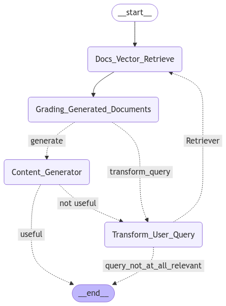

## Full loop summarized
```
Start
 → Retrieve docs
 → LLM checks doc relevance
 → If bad → rewrite question → retrieve again
 → If good → generate answer
 → LLM checks grounding
 → LLM checks question alignment
 → If bad → rewrite question → retrieve again
 → If good → END
```

--- 



### 1️⃣ __start__

#### Code: 
```
    workflow.add_edge(START, "Docs_Vector_Retrieve")
```

#### Meaning:
* Entry point of LangGraph
* Immediately routes to retrieval


### 2️⃣ Docs_Vector_Retrieve
#### Diagram node:   ``` Docs_Vector_Retrieve ```

#### Code:
```
    def retrieve(state: AgentState):
        question = state['question']
        documents = retriever.get_relevant_documents(question)
        return {"documents": documents, "question": question}
```

#### What happens: 
- Uses vector DB (Chroma + embeddings)
- Retrieves top-k chunks
- No filtering, no validation

#### ➡️ Output:
    state["documents"]

### 3️⃣ Grading_Generated_Documents
#### Diagram node:   ``` Grading_Generated_Documents```

#### Code
```
    def grade_documents(state: AgentState):
        for doc in documents:
            score = retrieval_grader.invoke({
                "question": question,
                "document": doc
            })
```
#### What happens
- LLM is used as a judge
- Each document is graded: "yes" or "no"
- Docs split into:
    - filter_documents
    - unfilter_documents
- This is retrieval validation, not generation.

### 4️⃣ Decision edge: generate vs transform_query
#### Diagram labels
    generate
    transform_query

#### Code
```
    def decide_to_generate(state: AgentState):
        if unfiltered_documents:
            return "transform_query"
        if filtered_documents:
            return "generate"
```
#### Interpretation
- ❌ Junk docs found → rewrite query
- ✅ Enough relevant docs → generate answer
- This is the first branching point.

### 5️⃣ Content_Generator (generate path)
#### Diagram node
    Content_Generator

#### Code
```
    def generate(state: AgentState):
        generation = rag_chain.invoke({
            "context": documents,
            "question": question
        })
```

#### What happens: 

- Classic RAG:
    - Prompt + docs + question
- LLM produces an answer
- No trust yet

### 6️⃣ Decision edge: useful vs not useful
#### Diagram labels
    useful
    not useful

#### Code
```
    def grade_generation_vs_documents_and_question(state):
        score = hallucinations_grader.invoke(...)
```

    First check: hallucination
        if grade == 'yes':

    Second check: question alignment
        score = answer_grader.invoke(...)

#### Outcomes
- ✅ Grounded + answers question → useful
- ❌ Anything else → not useful

7️⃣ Transform_User_Query (two entry points)
#### Diagram node
    Transform_User_Query

This node is reached from two places:
- After bad retrieval
- After bad generation

#### Code
```
    def transform_query(state: AgentState):
        response = question_rewriter.invoke({
            "question": question,
            "documents": documents
        })
```
#### What happens
- LLM does one of two things:
    - Rewrites the question
    - Returns "question not relevant"
This is your self-correction loop.

### 8️⃣ Decision edge: Retriever vs query_not_at_all_relevant
#### Diagram labels
    Retriever
    query_not_at_all_relevant

#### Code
```
    def decide_to_generate_after_transformation(state):
        if question == "question not relevant":
            return "query_not_at_all_relevant"
        else:
            return "Retriever"
```

#### Meaning
- ❌ Question unrelated → END
- ✅ Rewritten question → go back to retrieval

``` 
This creates the loop:
Rewrite → Retrieve → Grade → ...
```

### 9️⃣ __end__
#### Diagram node
__end__

#### Code
- Implicit via: END


When execution ends: 
```
- Useful answer produced
- OR question declared irrelevant
```

- Final output: ``` app.invoke(inputs)["generation"] ```


